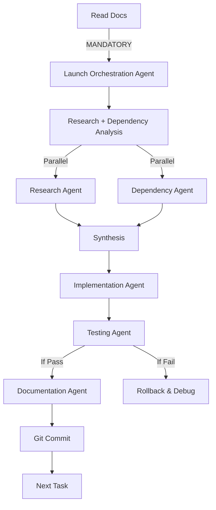

# 🤖 AI Council Sub-Agent System Documentation

**Created**: January 2025  
**Purpose**: Define specialized sub-agents for autonomous task execution in AI Council development  
**Status**: ACTIVE - Core development infrastructure

## 📋 Table of Contents
1. [Overview](#overview)
2. [Agent Hierarchy](#agent-hierarchy)
3. [Core Sub-Agents](#core-sub-agents)
4. [Usage Guidelines](#usage-guidelines)
5. [Best Practices](#best-practices)
6. [Integration with Workflow](#integration-with-workflow)

## Overview

The AI Council Sub-Agent System provides specialized autonomous MCP agents for different aspects of development, ensuring consistent quality, preventing feature breakage, and accelerating development through parallel task execution.

### Key Benefits:
- **Defensive Development**: Prevents breaking existing features
- **Parallel Execution**: Multiple agents working simultaneously
- **Specialized Expertise**: Each agent focused on specific domain
- **Workflow Enforcement**: Ensures best practices are followed
- **Comprehensive Testing**: Automated verification of all protected features

### Available MCP Agents:
- **orchestration-master** - Master coordinator
- **codebase-research-analyst** - Deep code analysis
- **dependency-analyzer** - Prevents breaking changes
- **surgical-implementer** - Precise code changes
- **product-guardian** - Strategic oversight
- **testing-validation-checker** - Comprehensive testing
- **documentation-sync** - Keeps docs updated
- **code-search-analyzer** - Deep codebase searches
- **architecture-planner** - System design
- **debug-analyzer** - Bug investigation
- **performance-optimizer** - Speed improvements
- **ui-ux-consistency-checker** - Design compliance

## Agent Hierarchy

```
┌─────────────────────────────────┐
│   orchestration-master          │
└────────────┬────────────────────┘
             │
    ┌────────┴────────┬────────────┬─────────────┬──────────────┐
    ▼                 ▼            ▼             ▼              ▼
┌─────────────────┐ ┌──────────────┐ ┌─────────────────┐ ┌──────────────┐ ┌────────────────┐
│codebase-research│ │dependency-   │ │surgical-        │ │testing-      │ │documentation-  │
│-analyst         │ │analyzer      │ │implementer      │ │validation-   │ │sync            │
│                 │ │              │ │                 │ │checker       │ │                │
└─────────────────┘ └──────────────┘ └─────────────────┘ └──────────────┘ └────────────────┘
```

## Core Sub-Agents

### 1. 🎯 orchestration-master (Master Controller)
**MCP Agent Type**: `orchestration-master`  
**Purpose**: Coordinate all other agents and ensure proper workflow execution

**Responsibilities**:
- Break down complex features into subtasks
- Assign tasks to appropriate specialized agents
- Ensure defensive development workflow is followed
- Coordinate parallel agent execution
- Synthesize results from multiple agents
- Create git checkpoints at critical stages
- Report comprehensive results

### 2. 🔍 codebase-research-analyst
**MCP Agent Type**: `codebase-research-analyst`  
**Purpose**: Deep analysis of codebase structure and feature requirements

**Responsibilities**:
- Analyze existing code patterns and architecture
- Identify data structures and flow
- Find integration points for new features
- Research similar implementations in codebase
- Identify potential risks and challenges

### 3. 🔗 dependency-analyzer
**MCP Agent Type**: `dependency-analyzer`  
**Purpose**: Map dependencies and prevent breaking changes

**Responsibilities**:
- Find all files importing/using target components
- Map component dependency tree
- Identify potential breaking changes
- Check for circular dependencies
- Verify TypeScript types consistency

### 4. 🛠️ surgical-implementer
**MCP Agent Type**: `surgical-implementer`  
**Purpose**: Execute code changes following defensive development practices

**Responsibilities**:
- Implement features using Edit (never Write on existing files)
- Follow existing code patterns and conventions
- Make minimal, surgical changes
- Maintain TypeScript type safety
- Follow component structure patterns

### 5. 🧪 testing-validation-checker
**MCP Agent Type**: `testing-validation-checker`  
**Purpose**: Comprehensive testing to ensure no features break

**Responsibilities**:
- Test all protected features from FEATURES.md
- Run TypeScript compilation checks
- Test with Playwright browser automation
- Verify user flows still work
- Performance testing

### 6. 📝 documentation-sync
**MCP Agent Type**: `documentation-sync`  
**Purpose**: Keep all documentation synchronized and current

**Responsibilities**:
- Update PRIORITIES.md with completed tasks
- Add new features to FEATURES.md protection list
- Update PROJECT_OVERVIEW.md capabilities
- Create next conversation prompts
- Maintain CHANGELOG

## Usage Guidelines

### When to Use Each Agent

| Scenario | Recommended Agent(s) | Reason |
|----------|---------------------|---------|
| New feature implementation | Orchestration → All agents | Comprehensive workflow |
| Bug fix | Dependency + Testing | Ensure fix doesn't break anything |
| Documentation update | Documentation Agent only | Focused task |
| Performance optimization | Research + Implementation + Testing | Analysis before changes |
| Refactoring | Dependency + Implementation + Testing | High risk of breakage |
| Adding new AI provider | Implementation + Testing | Isolated feature |

### Launching MCP Agents

#### Single Agent Launch:
```javascript
// For focused tasks
Task: {
  description: "Analyze debate data structure",
  prompt: "Analyze the current debate data structure in lib/agents/agent-system.ts...",
  subagent_type: "codebase-research-analyst"
}
```

#### Orchestrated Launch:
```javascript
// For complex features
Task: {
  description: "Implement Chain-of-Debate Display",
  prompt: "Coordinate implementation of Chain-of-Debate Display Enhancement...",
  subagent_type: "orchestration-master"
}
```

#### Parallel Agent Launch:
```javascript
// Launch multiple agents simultaneously
Tasks: [
  { subagent_type: "codebase-research-analyst" },
  { subagent_type: "dependency-analyzer" },
  { subagent_type: "documentation-sync" }
]
```

## Best Practices

### 1. **Always Start with Orchestration**
For any feature touching multiple files, start with the Orchestration Agent to coordinate properly.

### 2. **Dependency Check Before Changes**
Never skip the Dependency Agent when modifying existing components.

### 3. **Incremental Implementation**
Implementation Agent should make small, testable changes rather than large refactors.

### 4. **Comprehensive Testing**
Testing Agent must verify ALL protected features, not just the changed feature.

### 5. **Documentation First**
Read documentation before starting, update documentation after completing.

### 6. **Git Checkpoints**
Create commits after each successful agent task for easy rollback.

### 7. **Parallel When Possible**
Launch Research and Dependency agents in parallel to save time.

### 8. **Clear Communication**
Each agent should provide detailed reports with specific file:line references.

## Integration with Workflow

### Standard Feature Implementation Flow:



### Emergency Rollback Protocol:

If Testing Agent reports breakage:
1. Immediate: `git status` → `git diff`
2. Rollback: `git reset --hard HEAD`
3. Re-analyze with Dependency Agent
4. Smaller incremental changes
5. Re-test after each micro-change

## Metrics & Success Criteria

### Agent Performance Metrics:
- **Feature Completion Rate**: 95%+ without breaking existing features
- **Test Coverage**: 100% of protected features tested
- **Documentation Sync**: 100% up-to-date after each session
- **Rollback Frequency**: <5% of implementations
- **Development Speed**: 2-3x faster with parallel agents

### Success Indicators:
✅ No protected features broken  
✅ All TypeScript checks pass  
✅ Documentation fully updated  
✅ Git history shows clear checkpoints  
✅ Next session prompt ready  

## Future Enhancements

### Planned Agent Additions:
1. **Performance Agent**: Profile and optimize code
2. **Security Agent**: Audit for vulnerabilities
3. **Migration Agent**: Handle database/API migrations
4. **Design System Agent**: Ensure UI consistency
5. **Accessibility Agent**: WCAG compliance checking

### Agent Communication Protocol:
Future: Implement inter-agent communication for complex coordination without orchestration overhead.

---

**Note**: This sub-agent system is designed specifically for AI Council development but can be adapted for other projects. The key is maintaining the defensive development philosophy to prevent feature regression.

**Last Updated**: January 2025  
**Version**: 1.0.0  
**Status**: Active Production Use